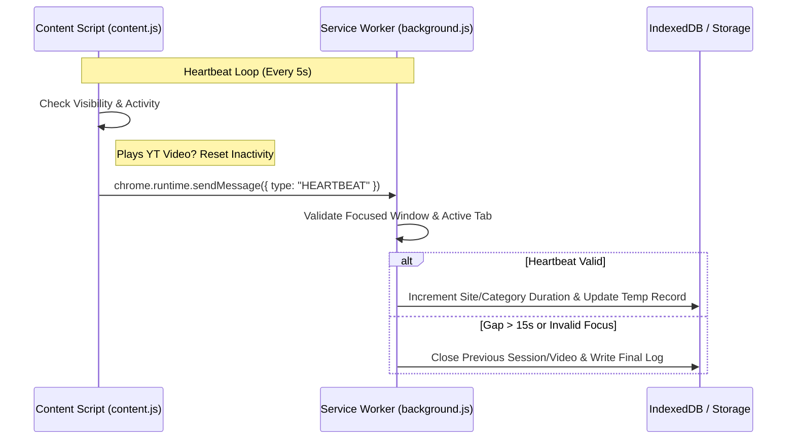

# PikaDex ⚡ — Pokémon Productivity Companion Chrome Extension

PikaDex is a modern, gamified productivity tracking Chrome Extension inspired by Pokédex interfaces and gaming HUDs. It measures active study and work engagement time, syncs coding metrics from external programming platforms, tracks YouTube video habits, and dynamically upgrades your Pokémon partner based on daily achievements.

---

## 🚀 Core Functionality

1. **Active Engagement Tracking**: Replaces simple page-visit counters with a precision heartbeat engine that tracks focused active duration (checking window focus, tab activation, page visibility, and mouse/keyboard idle timeouts).
2. **Onboarding & Customization**: Features an installation welcome page allowing trainers to name themselves and link their profiles. The popup remains locked behind an onboarding overlay until these variables are set.
3. **Coding Account Verification (Hybrid Sync)**: Integrates directly with GitHub and LeetCode APIs to verify solved problems and commits periodically, acting as the single source of truth for study XP awards.
4. **YouTube Media Logs & Shorts**: Tracks educational and entertainment watch logs, classifies video subjects dynamically using keyword mapping, supports Shorts, and dynamically handles late metadata updates.
5. **Professor Oak Daily Reports**: An optional AI feature leveraging Anthropic's Claude to review your daily stats and render a personalized, Pokémon-inspired performance review.

---

## 🗄️ Database Architecture (IndexedDB)

The extension uses IndexedDB under the database name `pikadex_v3` (Schema Version `2`). It contains five object stores:

### 1. `trainer`
Stores a single profile state (`key: 'profile'`) holding customization variables and lifetime analytics:
* `trainerName`: Dynamic string set during onboarding (defaults to `'Trainer'`).
* `onboarded`: Boolean flag blocking/unlocking the main HUD popup.
* `totalXP` / `todayXP`: Lifetime and current-day focus experience points.
* `level`: Automatically computed level based on XP (`totalXP / 500 + 1`).
* `streak`: Consecutive days reaching focus goals.
* `leetcodeUsername`, `githubUsername`, `codeforcesHandle`, `codechefHandle`, `hackerrankUsername`: Linked platform handles.
* `categorySeconds`: Durations per category (`Development`, `Learning`, `Entertainment`, `Social`, `AI Tools`, `General`).
* `githubRepos`: Object mapping repository names to active seconds today.
* `leetcodeProblems`: Object mapping problem slugs to active seconds and last visited timestamps.
* `chatgptTodayCount` / `chatgptTotalCount`: ChatGPT prompts sent.

### 2. `sessions`
Records finished web browsing sessions:
* `domain`: Visited host name (e.g. `leetcode.com`).
* `type`: Categorized productivity type.
* `startTime` / `endTime`: Epoch timestamps.
* `durationMs`: Total active focus duration in milliseconds.
* `xp`: Focus XP awarded.
* `date`: Calendar date.

### 3. `videos`
Stores completed YouTube video watch logs:
* `video_id`: Unique YouTube video identifier.
* `title`: Video title (self-heals dynamically on subsequent heartbeats).
* `channel`: Publisher channel name (self-heals).
* `url`: Direct clickable link to watch page.
* `educational`: Boolean classification.
* `category`: `'Educational'` or `'Entertainment'`.
* `watchSeconds`: Cumulative playing time.
* `date`: Calendar date.

### 4. `battles`
Logs study focus battles. Automatically triggered for sessions exceeding 2 minutes:
* `domain`: Associated domain.
* `durationMs`: Focus length.
* `won`: Boolean status (Victory for productive sites; Fled for Social sites; Victory on YouTube if educational, otherwise fled).
* `xp`: XP earned in the battle.

### 5. `site_stats`
Tracks exact cumulative focus durations per domain today and in total:
* `domain`: Domain key (e.g. `google.com`).
* `todaySeconds`: Active time logged today.
* `totalSeconds`: Cumulative active time logged.
* `lastVisit`: Timestamp of the last heartbeat.

---

## 💬 Chrome Runtime Messaging Protocol

The extension utilizes custom `chrome.runtime` messages to coordinate actions between the content script, popup dashboard, and background service worker.

### Sent to Background Script

| Message Type | Payload Fields | Purpose |
| :--- | :--- | :--- |
| `GET_DATA` | None | Returns merged data (`{trainer, sessions, videos, battles, site_stats}`) combined with any live in-progress sessions/videos from storage. |
| `UPDATE_PROFILE` | `{ fields }` | Overwrites profile variables inside IndexedDB and sets onboarding state. |
| `SYNC_ACCOUNTS` | None | Triggers LeetCode and GitHub API calls, awards XP for new achievements, and returns results. |
| `HEARTBEAT` | `{ domain, url, visible, userActive, youtube, githubRepo, leetcodeProblem }` | Dispatched from `content.js` every 5 seconds to feed active timing increments. |
| `CHATGPT_MESSAGE_SENT`| None | Fired from content script when a ChatGPT message prompt is submitted. |
| `PING` | None | Connection validation heartbeat. |

### Dispatched to Content Scripts

* `PIKA_CELEBRATE`: Triggers celebration animations and displays a dynamic greeting popup.
* `PIKA_WARN`: Displays warning overlays (e.g., when browsing restricted sites).
* `PIKA_XP`: Triggers an on-screen speech bubble with +XP announcements.
* `PIKA_EVOLVE`: Triggers Pikachu evolution celebrations and switches sprites.

---

## 🌐 External API Integrations

### 1. LeetCode Stats Sync
* **Primary Endpoint**: `https://leetcode.com/graphql`
* **Fallback Endpoint**: `https://leetcode-api-v2.herokuapp.com/api/userProfile/{username}`
* **Workflow**: Fetches user profile statistics, parses total solved problems, and queries the last 20 submissions to calculate the daily solve count.

### 2. GitHub Contribution Sync
* **Commits**: `https://api.github.com/search/commits?q=author:{username}+sort=author-date+order=desc+per_page=100` (calculates daily and total commits).
* **Pull Requests**: `https://api.github.com/search/issues?q=author:{username}+type:pr+sort=created+order=desc+per_page=100` (PR counts).
* **Issues**: `https://api.github.com/search/issues?q=author:{username}+type:issue+sort=created+order=desc+per_page=100` (issue counts).
* **Repos**: `https://api.github.com/users/{username}` (fetches public repository counts).

### 3. Professor Oak AI Review
* **Endpoint**: `https://api.anthropic.com/v1/messages`
* **Model**: `claude-haiku-4-5-20251001`
* **Workflow**: Packages today's focus metrics (active minutes, visited sites, LeetCode solves, GitHub commits, video watches) into a prompt to generate a friendly, sharp, Pokémon-themed productivity summary.

---

## 🔄 System Workflows

### Onboarding Flow
1. **First-Time Install**: `background.js` listens to `onInstalled`, detects `details.reason === 'install'`, initializes a blank profile with `onboarded: false`, and launches `welcome.html`.
2. **Popup Lock**: Opening the extension popup checks `t.onboarded`. If falsy, it hides the dashboard and displays the `#onboarding-overlay` setup panel.
3. **Form Submission**: Submitting setup details on `welcome.html` triggers `UPDATE_PROFILE` with fields and `onboarded: true`. The sync routine is run, and the main popup dashboard unlocks.
